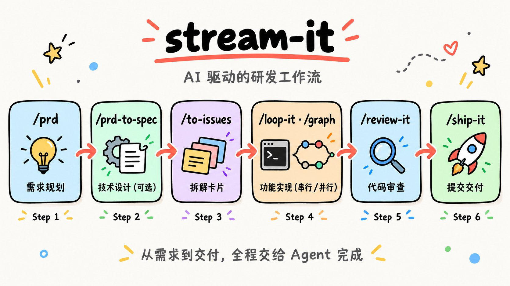

<div align="right">
  <span>[<a href="./README_EN.md">English</a>]</span>
  <span>[<a href="./README.md">简体中文</a>]</span>
</div>

<div align="center">
  <h1>stream-it</h1>
  <p>A complete software workflow inside your coding agent: requirements → design → breakdown → parallel implementation → review → shipping.<br>
  Skills make the judgment calls; ordering and checkpoints go to tested scripts; implementation goes to subagents isolated in their own git worktree.</p>
  <div align="center">
    <a href="https://9ashwin.github.io/stream-it/"></a>
    
    
    
    
  </div>
  <h3>
    <a href="https://9ashwin.github.io/stream-it/">Online docs</a> ·
    <a href="#quick-start">Install</a> ·
    <a href="#skills">Skills</a> ·
    <a href="#how-it-runs">Workflow</a> ·
    <a href="#project-status">Project Status</a>
  </h3>
  
</div>

## What is stream-it?

stream-it is a set of development-workflow skills: 26 skills that take a change from "an idea" to "shipped code" through standard steps — requirements, design, breakdown, implementation, review, shipping — each owned by one skill. You say what you want; the agent asks the questions, writes the PRD, splits it into Issues with blocking edges, implements in parallel inside isolated worktrees, reviews, opens the PR and merges.

**An implementation node is a subagent** in its own git worktree, and its job stops at "implement → prove it against the project's gates → commit on its own branch". Leak check, integration, gates on the integrated tree, review and shipping are one step, done **once per wave**: a single PR closes every Issue the wave satisfies.

Ordering, layering, cycle detection and checkpointing are arithmetic, and they live in the Python scripts shipped with the skills (standard library only, with self-tests). The skills themselves carry only judgement: **scripts do the arithmetic, skills do the judgement**.

## Quick Start

### Option 1: Install as a skill directory (recommended)

```bash
npx skills add 9Ashwin/stream-it       # installs globally (~/.agents/skills)
npx skills update -g                    # update from source later
```

The skills land in `~/.agents/skills`, and this route changes nothing in any profile's dependencies.

`npx skills` scans recursively and flattens `skills/<bucket>/<skill>` into `~/.agents/skills/<skill>` — a skill root is scanned only one level deep, so the flattening is required. Copying by hand means doing that step yourself:

```bash
cp -R <stream-it>/skills/flow/graph ~/.agents/skills/graph   # flattened, not the bucket
```

It can also be installed as **deployment configuration** (a preset that travels with the package, `toolFilter`, persona, commit pinning) — the commands, the flags and the trade-offs between the two routes are in the docs: **<https://9ashwin.github.io/stream-it/#install>**.

> [!TIP]
> Not sure which skill to reach for? Type **`/ask-flow`** — it names the next thing to type and the decisions that are yours to make.
>
> The full usage guide (installation, how to trigger each step, acceptance criteria, FAQ) lives at **<https://9ashwin.github.io/stream-it/>**, which redirects to the Chinese or English version based on your browser language; in the repo it is [docs/index_cn.html](docs/index_cn.html) and [docs/index_en.html](docs/index_en.html).

## How It Runs

Three phases with scopes that do not overlap:

| Scope | Does | Doesn't |
| --- | --- | --- |
| **Node** | Implements in its own worktree, proves itself with the project's gates, and **only commits to its own branch** | No push, no PR, no merge, no self-review |
| **Wave** | Leak check → merge only the nodes that finished → run gates on the integrated tree → **review once** (one section per node, focused on the seams between nodes) → **write the walkthrough once** (what changed, what was run, what it proved — it produces the PR body and the merge checklist) → **ship once** (one PR with a per-item evidence table) | No node-level PRs; no per-node walkthrough |
| **Batch** | The serial path in `/loop-it` works the same way: implement and commit one Issue at a time inline, then review, walk through and ship once at the end of the batch | — |

A few deliberate design choices:

- **Use `/graph` only when there is real parallelism.** One unit, two units that share a file, or chained work like "schema → API → UI" belongs in `/loop-it` or done inline — all of `/graph`'s value comes from nodes within a wave being genuinely independent.
- **A single-node wave skips the wave branch.** There is nothing to integrate, so that node's branch goes straight to review and shipping.
- **Failed nodes are retried in place first.** A follow-up message reuses that node's own context instead of paying for a fresh child; if the retry still fails, the node is re-run, and if it fails again it is dropped from the wave branch — its siblings were independent all along, so the rest ship as usual.
- **When one PR closes several Issues, list the evidence per item**: the commit, the Issue it closes, the test names that prove it, and the manual acceptance status. After a squash those commits are invisible on `main`, and without this table there is no way to roll back or audit one Issue on its own.

## Why stream-it

- **Cost is counted per wave, not per node.** Every subagent pays for the parent's system prompt, tool schemas, and skill catalog across its entire lifetime, and a `/review-it` + `/ship-it` per node means N PRs, N CI runs, and N chances to get stuck on a merge conflict. So nodes stop at commit, and review and shipping are collected at the wave level.
- **The arithmetic lives in scripts.** Dependency ordering, wave layering, scope-conflict serialization, and the checkpoint state machine all sit in `scripts/`, each with self-tests; the skills describe when to use them and where the boundaries are, not how the algorithm works.
- **Designed around real constraints, not an idealized model.** Subagents have no cwd of their own, every shell call is a fresh shell, delegation depth is capped, and the skill catalog is billed to every subagent — all of which became hard rules in the skills (absolute-path discipline plus leak checks against the shared checkout, nodes may not spawn further subagents, and an optional [lean-subagent patch](skills/flow/graph/references/lean-subagent.md)).

## Skills

**Not sure which one? Type `/ask-flow` first** — it names the next thing to type and does not act for you.

| Stage | Skill | What it does |
| --- | --- | --- |
| Entry | `/ask-flow` | Ask which skill or flow fits your situation (it routes only; it does not run anything) |
| Requirements & design | `/prd` · `/prd-to-spec` · `/to-design` · `/design-it` | Requirements doc → technical SPEC → Go-style design proposal → fixed-style HTML design doc |
| Breakdown & triage | `/to-issues` · `/triage` | Split your own PRD/SPEC into vertical slices · turn **incoming** raw issues into agent-ready cards |
| Implementation | `/implement` · `/test-first` · `/graph` · `/loop-it` | Finish a single unit inline · red-green testing · DAG waves in parallel (one worktree per node) · Issues in dependency order, serial (resumable checkpoints) |
| Diagnosis | `/diagnose` · `/conflict` | A debugging loop that demands a red-capable command first · resolve merge/rebase conflicts hunk by hunk by intent |
| Review & shipping | `/review-it` · `/walkthrough` · `/ship-it` · `/note-it` | Two-axis review (Spec + 8 standards dimensions) · the pre-merge walkthrough proving what changed and what was verified · commit/PR/merge/close Issue · implementation notes for an Issue |
| Code quality | `/smell` · `/refactor` · `/modern-go` | Architecture smells and complexity hotspots · Fowler's refactoring catalog · Go 1.0→1.27+ modernization |
| Reverse engineering & docs | `/code-to-spec` · `/understand` · `/insight-diagram` | Reverse a SPEC out of code · turn the current change into an interactive review page · UML/architecture diagrams |
| Content | `/humanize-it` · `/article-icons` · `/listenhub-tts` | De-AI-ify documents · article icons · text to speech |

Five skills carry `disable-model-invocation` (`/ask-flow`, `/insight-diagram`, and the three content tools in the last row) and stay **out of the model catalog**: the model will not reach for them on its own, you type the command — which saves the fixed cost every session **and every subagent** would otherwise pay. Across the current 26 skills the catalog is 5,077 characters, of which the model actually sees **3,806**. Those five also ship an `agents/openai.yaml` (`policy.allow_implicit_invocation: false`).

`/goal` is a DSH **command**, not a skill: you type it at the prompt to create a persisted goal with automatic continuation rounds. The model side of that surface is `create_goal` / `update_goal`, but `create_goal` only runs in a **direct top-level human turn** — a subagent or a mid-orchestration step cannot mint a long-horizon goal for itself.

## Repository layout

```
skills/
├── flow/       # one link in the PRD → ship chain, run in order (10)
├── practice/   # engineering practice you reach for mid-flow (7)
├── meta/       # about the skill set itself: the router (1)
└── bonus/      # produces non-code artifacts: design docs, diagrams, specs, content (8)
```

The test is the role a skill plays: `flow` is the pipeline itself; `practice` is what you reach for mid-flight because something broke or because quality is at stake (a testing method, diagnosis, conflicts, incoming triage, quality passes); `meta` describes the set itself (`/ask-flow`, the router); `bonus` produces artifacts that are not code.

A DSH skill root is scanned **exactly one level deep** (`<root>/<name>/SKILL.md`), so `cordis.patch.yml` lists each of the four buckets as its own root rather than pointing at `skills/`. `npx skills add` scans recursively and flattens on install; either install route yields exactly the same set. `scripts/check_skills.py` guards the two silent failures: **a skill left at the top level** (no root covers it) and **a bucket missing from the patch** (that whole bucket disappears without an error).

## Project Status

    

## Community & Feedback

- 🌐 [**Online docs**](https://9ashwin.github.io/stream-it/) — usage guides in Chinese and English
- 🐛 [**Issues**](https://github.com/9Ashwin/stream-it/issues) — bugs, feature requests, and skill improvements

## License

MIT — see [LICENSE](./LICENSE).
